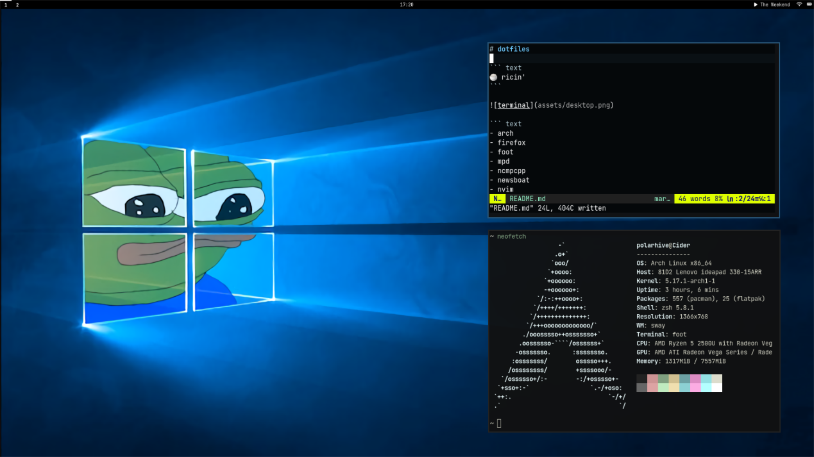

# dotfiles

``` text
🍚 ricin'
```



``` text
- arch
- firefox
- foot
- mpd
- ncmpcpp
- newsboat
- nvim
- sway
- zsh
```

## Setup?

- [Here's](https://polarhive.ml/blog/how-i-do-my-computing) how I do my computing 
- [Here's](https://polarhive.ml/blog/foss-music-setup) a post on my music streaming setup

---
This repo is hosted on [Codeberg](https://polarhive.ml/dots) & mirrored to [GitHub](https://polarhive.ml/github) for traffic.

[](https://www.gnu.org/licenses/gpl-3.0.txt)
