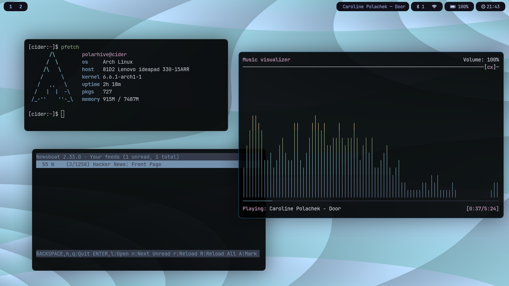

# dotfiles

``` sh
curl -sL polarhive.net/arch.sh | sh
```



``` text
- arch
- firefox
- foot
- mpd/ncmpcpp
- newsboat
- nvim
- tmux
- sway
- zsh
```

### misc
- [Here's](https://polarhive.net/blog/how-i-do-my-computing) how I do my computing
- [Here's](https://polarhive.net/blog/foss-music-setup) my music-streaming setup

---
This repo is hosted on [Codeberg](https://codeberg.org/polarhive/dots) & mirrored to [GitHub](https://polarhive.net/github) for traffic.

[](https://gplenforced.org)

